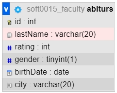
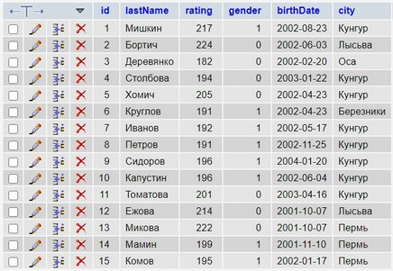

# Library mysql2

Для работы с базой данных MySQL будем использовать библиотеку mysql2.  
Документация по mysql2: https://www.npmjs.com/package/mysql2  

Для установки используйте пакетный менеджер:  

```js
npm i mysql2
```

Библиотека mysql2 предоставляет разработчику node.js программный интерфейс (API) доступа к базе данных MySQL. В наборе есть:  

- методы подсоединения к базе данных  
- запросы с передачей параметров  
- асинхронная работа запросов  
- поддержа коллбеков, промисов, асинронных функций (async, await)  
- создание пулов (множеств) подсоединений  

> В данном репозитории представлены примеры программ, которые в пошаговом режиме помогут вам разобраться с библиотекой mysql2 и с SQL-запросами, каждая директория посвящена определённой теме:  
> **part1-async** - способы работы с асинхронными методами  
> **part2-SQL** - организация базовых запросов CREATE, DROP, INSERT, UPDATE, DELETE, TRUNC, SELECT  
> **part3-pool** - организация пулов запросов к базе данных  
> **part4-queries** - примеры более сложных запросов к связным таблицам  

---  

## Подготовительный раздел  

Если вы хотите проводить эксперименты с представленными в этом пособии данными, запросами и программами, то можете самостоятельно создать таблицу и наполнить её подходящими значениями или просто сделать два запроса по созданию таблицы и по наполнению её данными:  

```SQL
CREATE TABLE `abiturs` (
    `id` INT NOT NULL AUTO_INCREMENT , 
    `lastName` VARCHAR(20) NOT NULL , 
    `rating` INT NOT NULL , 
    `gender` BOOLEAN NOT NULL , 
    `birthDate` DATE NULL , 
    `city` VARCHAR(20) NULL , 
    PRIMARY KEY (`id`)
);
```

```SQL
INSERT INTO abiturs (id, lastName, rating, gender, birthDate, city) 
VALUES 
    ('1','Мишкин','217','1','2002-08-23','Кунгур'),
    ('2','Бортич','224','0','2002-06-03','Лысьва'),
    ('3','Деревянко','182','0','2002-02-20','Оса'),
    ('4','Столбова','194','0','2003-01-22','Кунгур'),
    ('5','Хомич','205','0','2002-04-23','Кунгур'),
    ('6','Круглов','191','1','2002-04-23','Березники'),
    ('7','Иванов','192','1','2002-05-17','Кунгур'),
    ('8','Петров','191','1','2002-11-25','Кунгур'),
    ('9','Сидоров','196','1','2004-01-20','Кунгур'),
    ('10','Капустин','196','1','2002-06-04','Кунгур'),
    ('11','Томатова','201','0','2003-04-16','Кунгур'),
    ('12','Ежова','214','0','2001-10-07','Лысьва'),
    ('13','Микова','222','0','2001-10-07','Пермь'),
    ('14','Мамин','199','1','2001-11-10','Пермь'),
    ('15','Комов','195','1','2002-01-17','Пермь');
```

Создайте через панель управления phpMyAdmin в своём аккаунте базу данных и выполните последовательно приведённые выше два запроса в разделе SQL.  
По результатам этих запросов будет создана и заполнена таблица, которую можно посмотреть в разделе "Дизайнера" базы данных:  

  

а содержимое можно увидеть в разделе Обзор:  

  

---  

## Директория part2-SQL - разбор программ  

Простой пример чтения данных из существуюущей уже таблицы в существующей базе данных.  
Итак, для начала создадим вручную через панель phpMyAdmin базу данных и таблицу, добавим там же несколько записей.  
Если уже есть база данных и таблица, то как в node.js получить данные из таблицы?  
Нужно создать объект клиента для подсоединения и через него отправить запрос SELECT, например, так:  

### 00-select.js  

```js
const mysql = require("mysql2"); // подключаем библиотеку

const conn = mysql.createConnection({
    host: "localhost",
    port: "3306",
    user: "soft0015",
    password: "9LlvnQos",
    database: "soft0015_faculty"
});

conn.query("SELECT lastName, rating FROM abiturs", (err, results, fields) => {
    if (err) console.error(err);
    console.table(results);
    conn.end();
});
```

Объект клиента conn в качестве параметра принимает объект с параметрами (host, port, user, ...) подключения к базе данных.  
При обращении к методу query (есть аналогичный метод execute) будет выполнен запрос к базе данных.  
По результатам работы метода query в соотвествующих переменных будут находиться:  

- в переменной err код ошибки при возникновении исключительной ситуации во время выполнения запроса  
- в переменной results - результаты выполнения запроса в виде массива объектов  
- в переменной fields массив метаданных по полям таблицы - вы можете самостоятельно вывести на экран этот массив  

Обратите внимание, что эти данные передаются в callback функцию, которая написана после запроса вторым аргументом метода query.  
Только после того как запрос выполнится будет вызвана эта анонимная функция.  
В качестве тела функции вы можете написать дополнительный алгоритм по обработке полученных данных, сделать ещё запрос к базе данных, вывести результаты на экран или в файл.  
После одного или нескольких запросов к базе данных следует закрыть соединение - conn.end().  

Результаты работы программы:  

```js
┌─────────┬─────────────┬────────┐
│ (index) │  lastName   │ rating │
├─────────┼─────────────┼────────┤
│    0    │  'Мишкин'   │  217   │
│    1    │  'Бортич'   │  224   │
│    2    │ 'Деревянко' │  182   │
│    3    │ 'Столбова'  │  194   │
│    4    │   'Хомич'   │  205   │
│    5    │  'Круглов'  │  191   │
│    6    │  'Иванов'   │  192   │
│    7    │  'Петров'   │  191   │
│    8    │  'Сидоров'  │  196   │
│    9    │ 'Капустин'  │  196   │
│   10    │ 'Томатова'  │  201   │
│   11    │   'Ежова'   │  214   │
│   12    │  'Микова'   │  222   │
│   13    │   'Мамин'   │  199   │
│   14    │   'Комов'   │  195   │
└─────────┴─────────────┴────────┘
```

Метод query по умолчанию запускается в асинхронном режиме. Что это означает?  
Это значит, что строчки кода, написанные после запуска метода query будут запускаться независимо и сразу, не дожидаясь окончания работы query. От этого общий результат работы будет непредсказуем. Это можно увидеть на простом примере:

### 01-select.js  

```js
const mysql = require("mysql2");

const conn = mysql.createConnection({
    host: "localhost",
    port: "3306",
    user: "soft0015",
    password: "9LlvnQos",
    database: "soft0015_faculty"
});

let rows = []; // тут хотим хранить результат запроса к БД

conn.query("SELECT lastName, rating FROM abiturs", (err, results) => {
    rows = results;
    console.table(rows); // этот вывод будет вторым
});

console.table(rows); // этот вывод будет первым

conn.end();
```

Что в этой программе рискованного?  
Сначала будет инициализация пустого массива.  
Потом в асинхронном режиме запустится запрос на выборку из БД.  
И, не дожидаясь результата, запустится метод печати результатов на экран - console.table(rows).  
Но, так как данные ещё не будут получены из таблицы БД, то этот вывод будет пустым.  
Потом уже будут получены данные и будет совершён вывод из callback-функции метода query.  
Можете посмотреть что получится:  

```js
┌─────────┐
│ (index) │
├─────────┤
└─────────┘
┌─────────┬─────────────┬────────┐
│ (index) │  lastName   │ rating │
├─────────┼─────────────┼────────┤
│    0    │  'Мишкин'   │  197   │
│    1    │  'Бортич'   │  224   │
│    2    │ 'Деревянко' │  182   │
│    3    │ 'Столбова'  │  194   │
│    4    │   'Хомич'   │  205   │
│    5    │  'Круглов'  │  191   │
│    6    │  'Иванов'   │  192   │
│    7    │  'Петров'   │  191   │
│    8    │  'Сидоров'  │  196   │
│    9    │ 'Капустин'  │  196   │
│   10    │ 'Томатова'  │  201   │
│   11    │   'Ежова'   │  214   │
│   12    │  'Микова'   │  222   │
│   13    │   'Мамин'   │  199   │
│   14    │   'Комов'   │  195   │
└─────────┴─────────────┴────────┘
```

То есть логика последовательного исполнения инструкций в программе с асинхронными методами нарушается.  

Если вам нужна определённая последовательность выполнения операций обработки данных, то можно использовать три способа реализации:  

- через callback-функции  
- через промисы  
- через функции async/await  

Организацию таких последовательных запросов рассмотрим в другом разделе. А сейчас мы остановимся только на выполнении одиночного запроса к базе данных. Однако, даже в этом случае следует учитывать асинхронность выполнения самого запроса, так как вывод данных на экран или в файл может начаться раньше, чем будут получены результаты SQL-запроса. Поэтому все запросы будут реализованы в формате промисов.  

### 02-select.js

```js
const mysql = require("mysql2");

const conn = mysql.createConnection({
    host: "localhost",
    port: "3306",
    user: "soft0015",
    password: "9LlvnQos",
    database: "soft0015_faculty"
});

conn.promise()
    .query("SELECT lastName, rating FROM abiturs")
    .then(([rows]) => console.table(rows))
    .catch((err) => console.error(err))
    .then(conn.end());
```

В этой программе сначала получаем объект conn для соединения с БД.  
Потом получаем из него промис promise(), в котором последовательно реализуем методы:  
> сначала делаем запрос к БД методом query()  
> дождавшись ответа (метод then()), выводим результаты на экран в виде таблицы  
> в случае каких-то неполадок с запросом промис нас перебросит сразу на метод catch - там выведем > сообщение об ошибке  
> в самом конце закроем соединение  

Обратите внимание на странную организацию приёма параметров в анонимную collback-функцию в рамках метода then:  .then(([rows]) => console.table(rows)  
На самом деле, как и ранее (см. 00-select.js), туда передаются два массива (в качестве первого аргумента - результаты выполнения запроса в виде массива объектов, в качестве второго аргумента массив метаданных по полям таблицы). Но мы можем не принимать второй аргумент, однако данные передаются именно массивом, поэтому в шапке анонимной функции пишем именно так: [rows] - в переменную rows будет передан массив объектов как результат работы запроса SELECT.  

Чтобы особенность присваивания в массив, реализованная в js, вам была чуть более понятна, приведу такой пример по обмену значениями двух переменных не используя третью:  

### swap.js

```js
let x = 2;
let y = 7;

console.log(`x = ${x}; y = ${y}`);

[x,y] = [y,x];

console.log(`x = ${x}; y = ${y}`);
```

Результаты работы программы:

```js
x = 2; y = 7
x = 7; y = 2
```

Однако, продолжим по нашей теме...  
Можно в переменную conn сразу получить промис:  

### 03-select.js

```js
const mysql = require("mysql2"); // npm i mysql2

const conn = mysql.createConnection({
    host: "localhost",
    port: "3306",
    user: "soft0015",
    password: "9LlvnQos",
    database: "soft0015_faculty"
}).promise();

conn
    .query("SELECT lastName, rating FROM abiturs")
    .then(([rows]) => console.table(rows))
    .catch((err) => console.error(err))
    .then(conn.end());

```

Или оформить получение такого промиса в виде отдельной функции и убрать её в модуль, так как сами параметры подсоединения в дальнейшем будут одинаковы для всех последующих программ.  

### Модуль utils.js  

```js
const mysql = require("mysql2");

const paramsDB = {
    host: "localhost",
    port: "3306",
    user: "soft0015",
    password: "9LlvnQos",
    database: "soft0015_faculty"
};

function get_connection() {
    return mysql.createConnection(paramsDB);
}

module.exports.get_conn = get_connection;
```

Не забывайте делать публичными (module.exports.***) необходимые классы, функции, переменные, константы...  

И сама программа:  

### 04-select.js

```js
const ut = require('./modules/utils'); // модуль utils из папки modules

const conn = ut.get_conn();

conn.promise() // промис делаем тут
    .query("SELECT lastName, rating FROM abiturs")
    .then(([rows]) => console.table(rows))
    .catch((err) => console.error(err))
    .then(conn.end());
```

А так можно получить количество записей в таблице:  

### 05-count.js

```js
const get_conn = require('./modules/utils').get_conn;

const conn = get_conn();

conn.promise()
    .query("SELECT COUNT(*) FROM abiturs")
    .then(([rows]) => rows[0]['COUNT(*)'])
    .then((count) => { console.log('count =', count) })
    .catch((err) => { console.error(err) })
    .then(conn.end());

```

Тут есть ряд особенностей:  

1) показан способ как можно импортировать не весь модуль (если в нём много классов, функций), а только необходимый метод:  
const get_conn = require('./modules/utils').get_conn;  

2) в переменную rows попадает массив строк из SQL-запроса, но в данном случае запрос возвращает только одно значение, поэтому можно из массива взять только первое значение rows[0], этот первый элемент массива - это объект с именем поля 'COUNT(*)', из которого мы и извлекаем интересующее нас значение  

```js
// вот так выглядит массив rows  
rows == [ TextRow { 'COUNT(*)': 15 } ]  
```

3) метод then() что-то возвращает из своей callback-функции и может это передать на следующий этап (в следующий then) - это может быть как простое значение, так и очередной промис (будет показано в других примерах), инструкцию return можно задать явно, вот эти два варианта эквиваленты:  

```js
.then(([rows]) => rows[0]['COUNT(*)'])  

.then(([rows]) => { return rows[0]['COUNT(*)']; })  
```

Так можно оформить удаление таблицы:  

### 06-drop.js  

```js
const get_conn = require('./modules/utils').get_conn;

let query_drop = "DROP TABLE abiturs";

const conn = get_conn();

conn.promise()
    .query(query_drop)
    .then(() => console.log('table dropped'))
    .catch((err) => console.error(err))
    .then(() => {
        console.log('закрываем соединение');
        conn.end();
    });
```

Так можно отправить запрос на создание таблицы:  

### 07-create.js  

```js
const get_conn = require('./modules/utils').get_conn;

let query_create = "CREATE TABLE `abiturs` ( \
    `id` INT NOT NULL AUTO_INCREMENT , \
    `lastName` VARCHAR(20) NOT NULL , \
    `rating` INT NOT NULL , \
    `gender` BOOLEAN NOT NULL , \
    `birthDate` DATE NULL , \
    `city` VARCHAR(20) NULL , \
    PRIMARY KEY (`id`))";

const conn = get_conn();

conn.promise()
    .query(query_create)
    .then(() => console.log('table created'))
    .catch((err) => console.error(err))
    .then(conn.end());
```

Отметим особенности данного кода:  
В данном коде **обратный слеш** позволяет переносить длинную строку.  
**Обратный апостроф** в SQL-запросе тут использован для общего стиля.  
Обязательным он является, если имя поля в таблице с пробелом или название таблицы, столбца совпадает с зарезервированным словом MySQL, например, group.  

Добавим одну запись в таблицу:  

### 08-insert.js

```js
const ut = require('./modules/utils');  

let query_insert = "INSERT INTO abiturs \
(id, lastName, rating, gender, birthDate, city) \
VALUES \
(NULL, 'Сидоров', 207, true, '2002-08-03', 'Пермь')";

const conn = ut.get_conn();

conn.promise()
    .query(query_insert)
    .then(() => console.log('row inserted'))
    .catch((err) => console.error(err))
    .then(conn.end());
```

Обратите внимание, что в этой программе в SQL-запросе в качестве значения первого поля id передаётся NULL - это сделано намеренно, так как поле id мы раньше назначили автоинкрементным - при передаче NULL-значения в такое поле оно будет само формироваться.  

Если вы захотите очистить содержимое таблицы, то сделать это можно двумя похожими способами: через команду DELETE или через команду TRUNCATE:  

### 09-truncate.js  

```js
const get_conn = require('./modules/utils').get_conn;

let query_truncate = "TRUNCATE abiturs";
let query_delete = "DELETE FROM abiturs";

// сравнить DELETE vs TRUNCATE - delete не обнуляет индексацию 

const conn = get_conn();

conn.promise()
    .query(query_truncate)
    .then(() => console.log('table truncated'))
    .catch((err) => console.error(err))
    .then(conn.end());
```

Тут особенность состоит в том, что SQL-команда DELETE удаляет записи из таблицы не стирая индексацию автоинкрементного поля. Это значит, что после очистки таблицы и последующей вставки в неё записей их индексаци продолжится не с нуля. У вас есть возможность самостоятельно провести этот эксперимент...  

---  
