# Library mysql2

## Директория part4-views - примеры работы с представлениями  

В данной директории приведены примеры SQL-запросов и программ по работе с представлениями в MySQL через phpMyAdmin и Node.js.  

Будем использовать MySQL 8, документация [MySQL 8](https://dev.mysql.com/doc/refman/8.0/en/sql-data-manipulation-statements.html)  

## Введение в язык структурированных запросов SQL

Предполагается, что данные распределены по таблицам и могут иметь логические связи между полями таблиц.  

Синтаксис SQL включает несколько категорий команд, основные из них:  

1) DDL – язык определения данных (Data Definition Language) - для декларации структуры таблиц;  
2) DML – язык манипулирования данными (Data Manipulation Language)- для изменения записей в таблицах;  
3) DQL – язык запросов (Data Query Language) - для выборки данных из таблиц;  
4) DCL – язык управления данными (Data Control Language) - для управления доступом к таблицам.  

> Начальный уровень подготовки по реляционным базам данных можно ограничить:  
> Подмножеством команд DQL:  
> . . . SELECT  
> Подмножеством команд DML:  
> . . . INSERT, UPDATE, DELETE  
> Подмножеством команд DDL:  
> . . . CREATE TABLE, ALTER TABLE, DROP TABLE, CREATE INDEX, ALTER INDEX, DROP INDEX  

---  

Так можно создать таблицу:  

```SQL
CREATE TABLE `abiturs` (
    `id` INT NOT NULL AUTO_INCREMENT , 
    `firstName` VARCHAR(20) NOT NULL , 
    `lastName` VARCHAR(20) NOT NULL , 
    `rating` INT NOT NULL , 
    `city` VARCHAR(20) NULL , 
    PRIMARY KEY (`id`)
);
```

Так можно добавить в таблицу несколько записей:  

```SQL
INSERT INTO abiturs (firstName, lastName, rating, city) 
VALUES 
    ('Женя','Мишкин','217','Кунгур'),
    ('Роман','Бортич','224','Лысьва'),
    ('Оксана','Деревянко','182','Оса'),
    ('Анна','Столбова','194','Кунгур'),
    ('Женя','Хомич','205','Кунгур'),
    ('Коля','Круглов','191','Березники'),
    ('Иван','Иванов','192','Кунгур'),
    ('Петя','Петров','191','Кунгур'),
    ('Женя','Сидоров','196','Кунгур'),
    ('Егор','Капустин','196','Кунгур'),
    ('Алиса','Томатова','201','Кунгур'),
    ('Клава','Ежова','214','Лысьва'),
    ('Женя','Микова','222','Пермь'),
    ('Иаков','Мамин','199','Пермь'),
    ('Стёпа','Комов','195','Пермь');
```

---

## Представления  

Однако командой CREATE можно создавать не только статичные таблицы, но и виртуальные (динамические) таблицы - их называют представлениями. Представления содержат SELECT-запрос к одной или нескольким таблицам или другим представлениям - этот SELECT-запрос возвращает (формирует) таблицу из текущих данных. Сама таблица и данные в ней из представления не существуют реально, они формируются непосредственно по результатам запроса. Общий вид команды на формирование представления может выглядеть так:  

```SQL
CREATE VIEW view_1 AS
SELECT * FROM table_1
```

Данный запрос создаёт в базе данных виртуальную таблицу view_1, которая является копией таблицы table_1. Понятное дело, что особого смысла именно в этом представлении нет, так как никаких новых данных или новых сочетаний данных мы не получили - это был просто пример.  
Представления удобно применять в тех случаях, когда:  

- данные в исходных таблицах нормализованы и неудобны для непосредстенного использования или  
- некоторая выборка данных из исходных таблиц часто нужна и сам запрос удобно хранить непосредственно в базе данных или  
- запросы достаточно сложные и удобно пользоваться вложенными запросами (тогда более элементарные запросы можно хранить в виде представлений и обращаться к ним из сложных запросов)  
- вы используете какой-то язык программирования для обращения к базе данных, то часть наиболее популярных запросов на выборку данных можно хранить в виде представлений непосредственно в базе данных и к ним обращаться из Вашей программы.  

---  

Теперь рассмотрим пример базы данных со связными таблицами, создадим там представление, получим отображение данных через phpMyAdmin и через программу на node.js (в консоли).  

В папке [csv](./csv/) есть файлы students.csv и studygroups.csv с данными по студентам и учебным группам.  
Я импортировал обе таблицы в базу данных:  

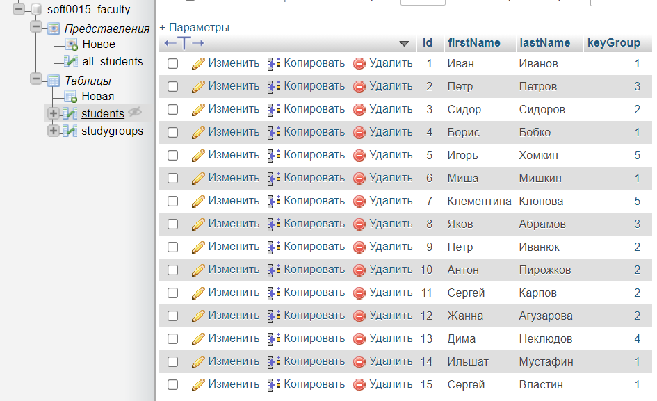  

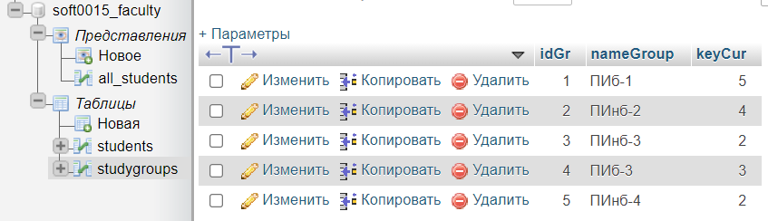  

настроил типы данных полей таблиц и индексацию:  

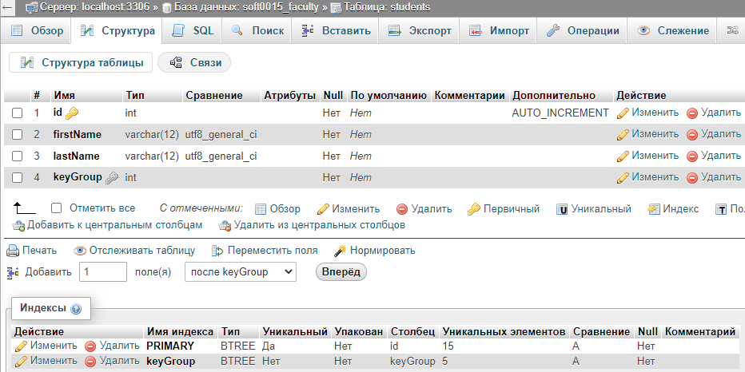  

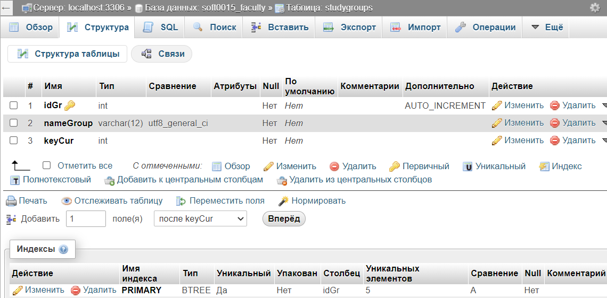  

а также установил внешний ключ для связи дочерней и родительской таблиц:  
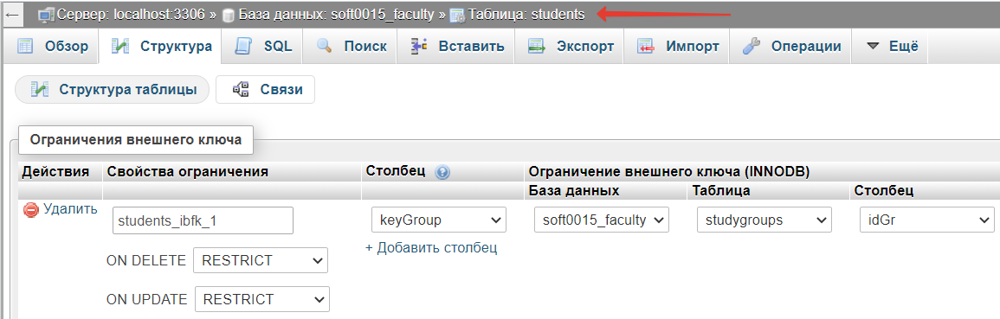  

После чего в Дизайнере можно увидеть схему базы данных примерно в таком виде:  

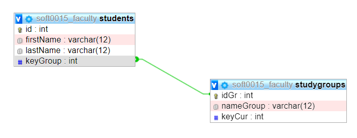  

В исходной таблице студентов имена и фамилии хранятся в отдельных столбцах. Предположим, что нам нужна таблица со списком студентов из группы 'ПИб-1' и, при этом, 'Фамилия Имя' должны быть объеденены в одном столбце.  

Сначала попробуем выполнить запрос:  

```SQL
SELECT
    CONCAT_WS(
        ' ',
        `students`.`lastName`,
        `students`.`firstName`
    ) AS `fullName`
FROM `students`
JOIN `studygroups` ON `studygroups`.`idGr` = `students`.`keyGroup`
WHERE `studygroups`.`nameGroup` = 'ПИб-1'
ORDER BY `fullName` ASC
```

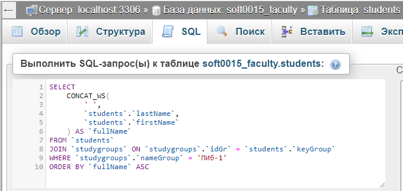  

Мы получим нужный результат:  
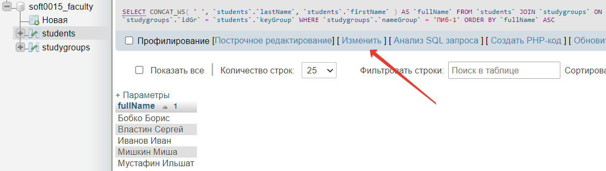  

Однако, им нельзя будет воспользоваться впоследствии. Чтобы сохранить этот запрос в базе данных, создадим представление, для чего нажмём на клавишу 'Изменить' и в открывшемся окне редактирования SQL-запроса добавим одну строчку (CREATE VIEW view_students AS), затем выполним обновлённый запрос:  

```SQL
CREATE VIEW view_students AS
SELECT
    CONCAT_WS(
        ' ',
        `students`.`lastName`,
        `students`.`firstName`
    ) AS `fullName`
FROM `students`
JOIN `studygroups` ON `studygroups`.`idGr` = `students`.`keyGroup`
WHERE `studygroups`.`nameGroup` = 'ПИб-1'
ORDER BY `fullName` ASC
```

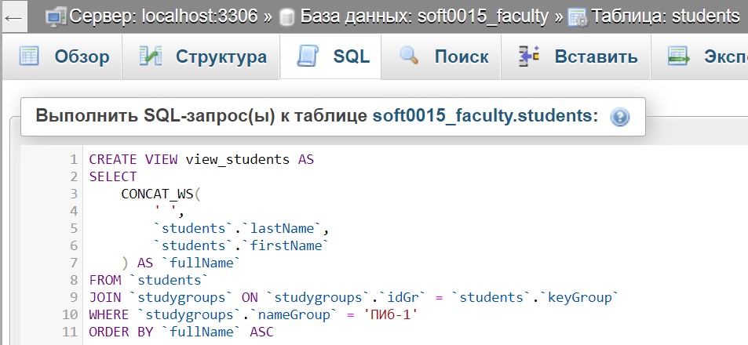  

Теперь в базе данных появилась новая таблица - виртуальная - в ней значения появляются только в момент обращения к представлению:  

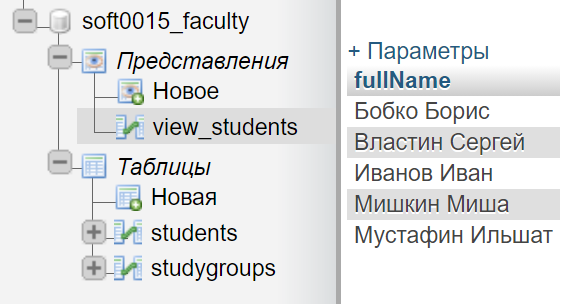  

Вы можете с ней работать почти как с обычной таблицей - ей можно сменить имя, её можно удалить. Так же можно изменить её содержание сменив сам SELECT-запрос. Кроме того, её можно использовать при обращении из других SQL-запросов или из каких-либо программ.  

Давайте рассмотрим пример обращения к этому представлению из программы на node.js  

Программный код:  

```js
const mysql = require("mysql2");

const conn = mysql.createConnection({
    host: "pgsha.ru",
    port: "35006",
    user: "soft0015",
    password: "9LlvnQos",
    database: "soft0015_faculty"
});

let query = "SELECT * FROM view_students";

conn.promise()
    .query(query)
    .then(([rows]) => console.table(rows))
    .catch((err) => { console.error(err) })
    .then(conn.end());
```

Окно редактора VS Code после запуска программы с результатами в терминале:  

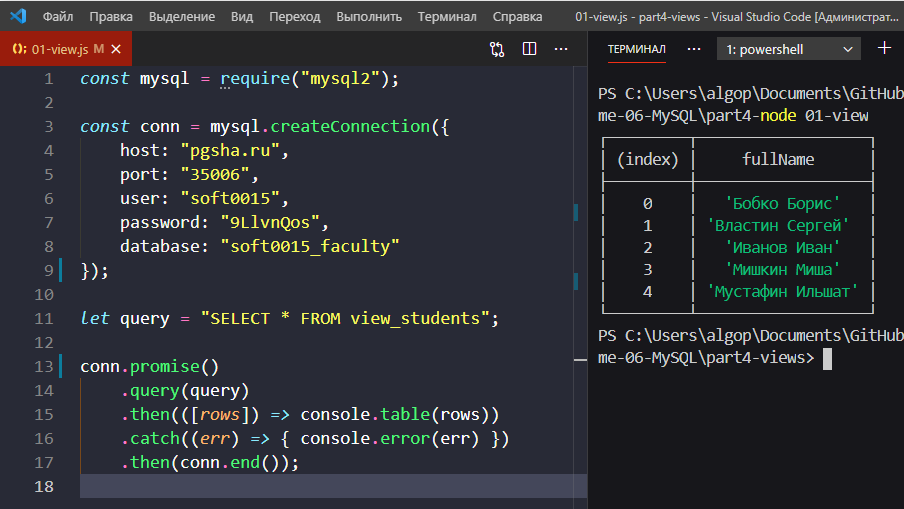  

Таким образом можно составлять разнообразные представления и сохранять их в базе данных для того, чтобы впоследствии пользоваться ими в рамках самостоятельных или более сложных запросов, в том числе, вызывая их из своих программ на node.js.  

```txt

```
