# Library mysql2

## Директория part5-express - рендеринг web-страниц  

В данной директории приведены примеры программ по выводу данных на web-страницу и организации работы с данными из базы данных MySQL через Node.js и Express.  

```txt
```

## Директория 00-server  

Организация сервера средствами Node.js.  

Итак, ранее мы делали программы консольные, теперь попробуем выводить результаты на html-страницу в браузере.  

---  

### server01.js  

```js
const http = require("http"); // модуль http есть по умолчанию

http.createServer((request, response) => {
    response.end("testing the server ...");
}).listen(3000, "127.0.0.1", () => {
    console.log("смотрим работу через браузер - http://localhost:3000");
    let isWin = process.platform === "win32";
    let hotKeys = isWin? "Ctrl+C": "Ctrl+D"; // Windows or Linux
    console.log(`остановить сервер - ${hotKeys}`);
});
```

Попробуйте создать и запустить на исполнение из консоли программу server01.js. После запуска вы увидите служебное сообщение в консоли и ссылку - перейдите по ней или просто в адресной строке браузера наберите адрес http://localhost:3000 и перейдите по этому адресу. Откроется web-страница с сообщением "testing the server ...". Адрес 3000 - это просто произвольно выбранный свободный порт.  

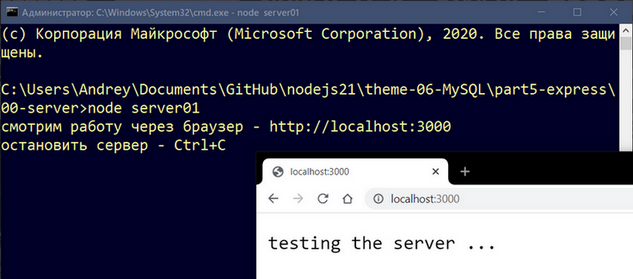  

Остановить работу сервера можно сочетанием клавиш "Ctrl+C" или "Ctrl+D" (зависит от операционной системы). Если такую программу запустить на хостинге с Node.js, то она станет доступна и другим пользователям через браузер.  

---  

Теперь сделаем немного посложнее - данные для отображения на web-странице будут браться из текстового файла.  

### server02.js  

```js
const http = require("http");
const fs = require('fs');

const server = http.createServer((req, res) => {
    res.writeHead(200, {'Content-Type': 'text/plain'});
    let myReadStream = fs.createReadStream('./block.txt', 'utf8');
    myReadStream.pipe(res);
});

server.listen(3000, "127.0.0.1", () => {
    console.log("смотрим работу через браузер - http://localhost:3000");
    let isWin = process.platform === "win32";
    let hotKeys = isWin? "Ctrl+C": "Ctrl+D"; // Windows or Linux
    console.log(`остановить сервер - ${hotKeys}`);
});
```

Остановите предыдущую запущенную программу и запустите новую server02.js - в браузере отобразится содержимое текстового файла:  

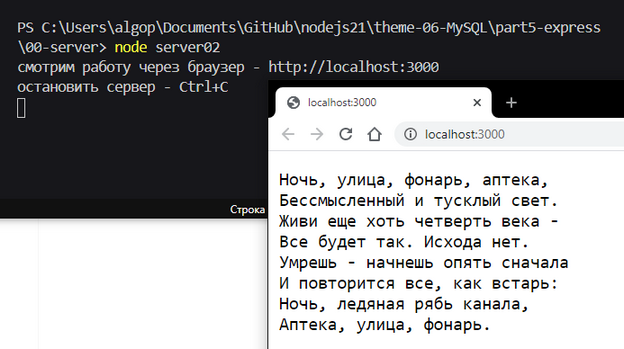  

---  

Для отображения структурированного файла с html разметкой следует изменить тип контента - 'Content-Type': 'text/html':  

### server03.js  

```js
const fs = require('fs');
const http = require("http");

var server = http.createServer((request, response) => {
    response.writeHead(200, {'Content-Type': 'text/html'});
    let myReadStream = fs.createReadStream('./block.html', 'utf8');
    myReadStream.pipe(response);
});

server.listen(3000, "127.0.0.1", () => {
    console.log("смотрим работу через браузер - http://localhost:3000");
    let isWin = process.platform === "win32";
    let hotKeys = isWin? "Ctrl+C": "Ctrl+D"; // Windows or Linux
    console.log(`остановить сервер - ${hotKeys}`);
});
```

Результаты работы этой программы смотрим в браузере (по адресу http://localhost:3000 или http://127.0.0.1:3000):  

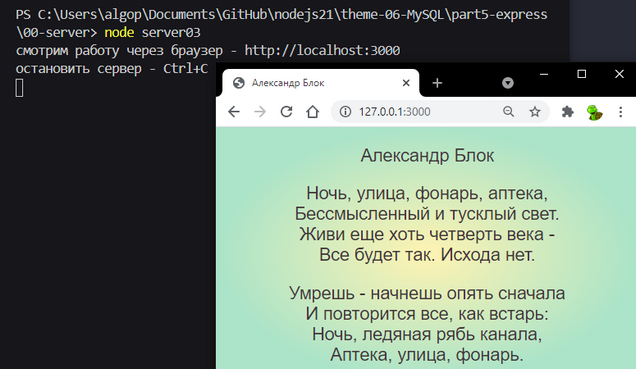  

Таким образом мы можем организовать вывод любых данных в разном формате на web-страницу.  

---  

Однако для некоторых стандартных задач удобнее использовать специально подготовленные для этого инструменты - пришло время познакомиться с фреймворком Express.  
Express может обеспечить интеграцию вашего web-приложения с разнообразными базами данных, определить маршрутизацию, то есть реакцию приложения на запрос клиента, включая запросы GET и POST, переопределить адресацию к статическим файлам (картинки, css и т.п.).  

```txt
```

## Директория 01-express  

Организация сервера средствами Node.js и Express.  

Теперь уже будем делать web-приложения, поэтому программы будут иметь префикс app.  
Перед началом работы следует установить фреймворк Express через пакетный менеджер:  

```js
npm i express
```

---  

### app_01.js  

```js
const express = require('express');
const app = express();
 
app.get('/', function (req, res) {
    res.send('testing the framework Express ...');
});
 
const server = app.listen(3000, function () {
    let port = server.address().port;
    console.log("смотрим работу через браузер - http://localhost:%s", port);
    let isWin = process.platform === "win32";
    let hotKeys = isWin? "Ctrl+C": "Ctrl+D"; // Windows or Linux
    console.log(`остановить сервер - ${hotKeys}`);
});
```

Порядок работы такой же: запускаем программу через консоль, результаты смотрим через браузер:  

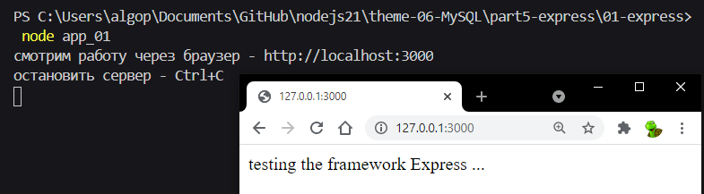  

---  

До сих пор мы в окно браузера выводили фиксированную (предопределённую) информацию. Давайте попробуем добавить в наше web-приложение функционал, реагирующий на запросы клиента - у нас будет три варианта страницы: стартовая, select, update.  
Как это работает? В приложении будут добавлены обработчики - методы выполнения запросов типа GET - они возвращают в браузер реакцию от нашего Express`а.  

### app_02.js  

```js
const express = require('express');
const app = express();
 
app.get('/', function (req, res) {
    res.send('testing the framework Express ...');
});
 
app.get('/select', function (req, res) {
    res.send('testing the select ...');
});

app.get('/update', function (req, res) {
    res.send('testing the update ...');
});

const server = app.listen(3000, function () {
    let port = server.address().port;
    console.log("смотрим работу через браузер - http://localhost:%s", port);
    let isWin = process.platform === "win32";
    let hotKeys = isWin? "Ctrl+C": "Ctrl+D"; // Windows or Linux
    console.log(`остановить сервер - ${hotKeys}`);
});
```

Порядок работы такой же: запускаем программу через консоль, результаты смотрим через браузер, вручную (пока) переходя по разным путям (смотри адресную строку):  

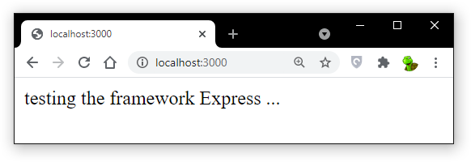  

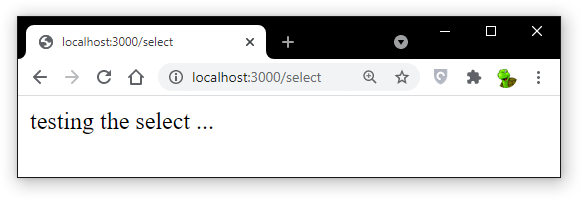  

  

---  

Запрос типа GET что-то возвращает нам, а через запрос типа POST мы можем что-то передать. Позже мы будем через него передавать различные параметры для выполнения SQL-запросов к базе данных, а пока просто апробируем работоспособность этого метода. Нам потребуется экранная форма в виде html-документа:  

```html
<html>
    <head>
        <meta charset="utf-8" />
    </head>
    <body>
        <form action = "//127.0.0.1:3000/post" method = "POST">
            Фамилия: <input type = "text" name = "last_name" /> <br />
            Рейтинг: <input type = "text" name = "rating" /> <br />
            <input type = "submit" value = "Submit" />
        </form>
    </body>
</html>
```

Через эту форму будем передавать объект user с параметрами last_name и rating, метод post будет вызывать при нажатии на клавишу submit, после чего полученные данные будут сохранены в файл user.json, а метод get, как и ранее, просто отобразит файл index.htm с экранной формой ввода:  

### app_03.js  

```js
const express = require('express');
const fs = require('fs');

const app = express();

let urlencodedParser = express.urlencoded({ extended: false })

app.get('/', function (req, res) {
    let filePath = __dirname + "/" + "index.htm";
    res.sendFile(filePath);
});

app.post('/post', urlencodedParser, function (req, res) {
    let user = {
        last_name: req.body.last_name,
        rating: req.body.rating
    };
    fs.writeFileSync('user.json', JSON.stringify(user));
    res.end('data post in file');
});

const server = app.listen(3000, function () {
    var port = server.address().port;
    console.log("смотрим работу через браузер - http://localhost:%s/", port);
    let isWin = process.platform === "win32";
    let hotKeys = isWin? "Ctrl+C": "Ctrl+D"; // Windows or Linux
    console.log(`остановить сервер - ${hotKeys}`);
});
```

Итак вы запускаете приложение, оно выводит в браузере экранную форму ввода данных:  

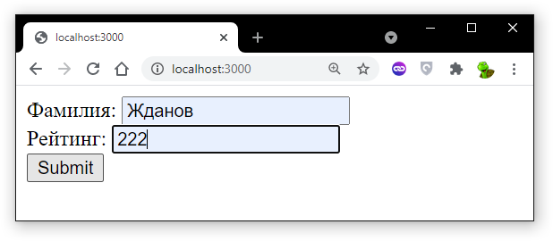  

После срабатывания клавиши Submit в браузере отобразится надпись:  

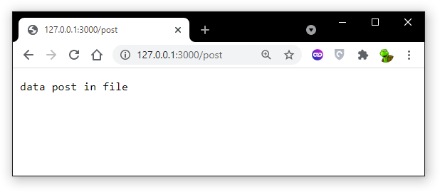  

а в файле user.json будет записан этот объект:  

```js
{"last_name":"Жданов","rating":"222"}
```

```txt
```

## Директория 02-express  

Организация рендеринга страницы  

Переходим к организации работы с данными из базы данных. Все последующие примеры будут посвящены работе с ОДНОЙ таблицей abiturs:  

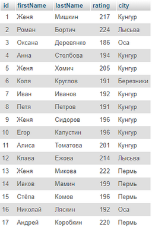  

> Если на момент прочтения этого документа нет этой базы данных или таблицы в ней или данные испорчены, то вы можете самостоятельно сделать у себя такую таблицу из данных, находящихся в папке csv в файле [abiturs.csv](./02-express/csv/abiturs.csv).  

Для отображения этих данных на статичной странице создадим приложение, состоящее из трёх файлов: app.js, index.hbs, style.css:  

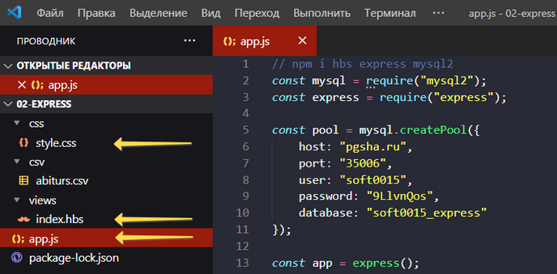  

Файл app.js расположите в корневой папке приложения, index.hbs - в папке с представлениями (views), style.css - в папке css.  

Перед рассмотрением программы app.js обсудим особенности организации приложения Express. Приложение Express для определения визуального интерфейса использует не стандартные файлы html, а представления (views). В этих представлениях можно размещать шаблоны, вместо которых программа на js в процессе рендеринга будет вставлять какое-то динамическое содержимое. Для управления представлениями во время работы приложения следует подключить один из существующих движков (view engine): Handlebars, Pug, Jade, Dust, Nunjucks, EJS. Мы будем использовать движок Handlebars, именно поэтому файлы представлений будут иметь расширение hbs.  

Содержимое index.hbs:  

```html
<!DOCTYPE html>
<html>
<head>
    <title>Express</title>
    <meta charset="utf-8" />
    <link rel="stylesheet" type="text/css" href="css/style.css" />
</head>
<body>
    <center>
    <h3>Список абитуриентов</h1>
    <table>
        <tr>
            <th>Рейтинг</th>
            <th>Фамилия</th>
            <th>Имя</th>
            <th>Город</th>
        </tr>
        {{#each abiturs}}
            <tr>
                <td>{{this.rating}}</td>
                <td>{{this.lastName}}</td>
                <td>{{this.firstName}}</td>
                <td>{{this.city}}</td>
            </tr>
        {{/each}}
    </table>
    </center>
</body>
<html>
```

В этом файле вы видите определённый синтаксис, который и будет обрабатываться движком, а именно, цикл {{#each abiturs}} (массив abiturs будет передан из программы app.js) и обращение в каждому объекту this во время работы этого цикла с выводом определённого поля объекта: {{this.rating}} и т.д. Все эти поля уже расставлены на соответсвующие позиции.  

Чтобы будущая html-страница, которая будет сформирована из index.hbs имела презентабельный вид можно добавить описание стилей:  

```css
BODY {
    background-color: gainsboro; /* цвет фона */
    font-family: Arial, Helvetica, sans-serif; /* шрифты */
}

TABLE {
    border-collapse: collapse; /* Убираем двойные линии между ячейками */
    width: 60%; /* Ширина таблицы */
}

TH, TD {
    border: 1px solid black; /* Параметры рамки */
    text-align: center; /* Выравнивание по центру */
    padding: 4px; /* Поля вокруг текста */
}

TH {
    background: #fc0; /* Цвет фона ячейки */
    height: 30px; /* Высота ячеек */
}
```

И, наконец, программа, которая запускает приложение:  

### app.js  

```js
// npm i hbs express mysql2
const mysql = require("mysql2");
const express = require("express");

const pool = mysql.createPool({
    host: "pgsha.ru",
    port: "35006",
    user: "soft0015",
    password: "9LlvnQos",
    database: "soft0015_express"    
});

const app = express();
app.use('/css', express.static(__dirname + '/css'));
app.set("view engine", "hbs");

app.get("/", function(req, res) { // получим список данных
    let query = "SELECT rating, lastName, firstName, city \
    FROM abiturs ORDER BY rating DESC";
    pool.query(query, function(err, data) {
        if (err) return console.log(err);
        res.render("index.hbs", {
            abiturs: data
        });
    });
});
 
app.listen(3000, function() {
    console.log("смотрим работу через браузер - http://localhost:3000/");
    let isWin = process.platform === "win32";
    let hotKeys = isWin? "Ctrl+C": "Ctrl+D"; // Windows / Linux
    console.log(`остановить сервер - ${hotKeys}`);
});
```

Не забудьте перед началом работы установить необходимые библиотеки:  

```js
npm i hbs express mysql2
```

В программе app.js сначала мы определяем пул соединений. Именно пул нужен будет позже, когда с одной страницы мы будем делать разные запросы: SELECT, INSERT, UPDATE, DELETE. В этом приложении мы ограничимся одним запросом на выборку данных. После получения данных из базы данных они размещаются в переменной data - их передаём на рендеринг документа index.hbs через переменную abiturs.  

Для определения движка выполняем эту строчку: app.set("view engine", "hbs");  
Для указания места расположения статических файлов с таблицами стилей выполняем эту строчку: app.use('/css', express.static(__dirname + '/css'));  

Если всё было настроено корректно, то после запуска в консоли программы app.js запустится сервер, будет направлен запрос к базе данных, получены данные и через браузер можно будет увидеть результат рендеринга странички:  

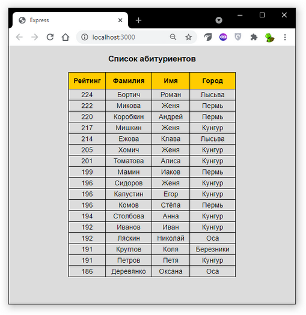  

Итак, мы можем заранее создать шаблон html-страницы и, при переходе на неё, отображать актуальные данные, получаемые из базы данных по SQL-запросу.  

```txt
```

## Директория 03-express  

Расширение функционала  

Теперь пришла пора добавить возможность добавлять, исправлять и удалять записи в таблице.  

Состав приложения будет такой - программа app.js, три представления (index.hbs, create.hbs, edit.hbs) и style.css:  

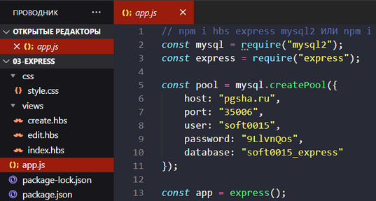  

В стилях было немного добавлено:  

```css
body {
    background-color: gainsboro; /* цвет фона */
    font-family: Arial, Helvetica, sans-serif; /* шрифты */
}
table {
    border-collapse: collapse; /* Убираем двойные линии между ячейками */
    width: 68%; /* Ширина таблицы */
}
th, td {
    border: 1px solid black; /* Параметры рамки */
    text-align: center; /* Выравнивание по центру */
    padding: 4px; /* Поля вокруг текста */
}
th {
    background: #fc0; /* Цвет фона ячейки */
    height: 32px; /* Высота ячеек */
}
td {
    background: rgb(255, 244, 200); /* Цвет фона ячейки */
}
td.editor {
    background: rgb(190, 190, 190); /* Цвет фона ячейки */
}
a { 
    text-decoration: none; /* Отменяем подчеркивание у ссылки */
    color: green;
    font-weight: 600;
}
```

Далее шаблоны страничек.  

**create.hbs**:

```html
<!DOCTYPE html>
<html>
<head>
    <title>create abiturient</title>
    <meta charset="utf-8" />
    <link rel="stylesheet" type="text/css" href="/css/style.css" />
    <style>.field{width:200px;}</style>
</head>
<body>
    <h1>Добавить абитуриента</h1>
    <form method="POST">        
        <label>Имя</label><br>
        <input name="firstName" class="field" /><br><br>

        <label>Фамилия</label><br>
        <input name="lastName" class="field" /><br><br>
        
        <label>Рейтинг</label><br>
        <input name="rating" type="number" class="field" min="0" max="300" /><br><br>

        <label>Город</label><br>
        <input name="city" class="field" /><br><br>
        
        <input type="submit" value="Сохранить" />
    </form>
    <a href="/">На главную</a>
</body>
<html>
```

**edit.hbs**:

```html
<!DOCTYPE html>
<html>
<head>
    <title>edit abiturient</title>
    <meta charset="utf-8" />
    <link rel="stylesheet" type="text/css" href="/css/style.css" />
    <style>.field{width:200px;}</style>
</head>
<body>
    <h1>Изменить данные</h1>
    <form action="/edit" method="POST">
        <input type="hidden" name="id" value="{{abiturient.id}}" />
        
        <label>Имя</label><br>
        <input name="firstName" class="field" value="{{abiturient.firstName}}" /><br><br>

        <label>Фамилия</label><br>
        <input name="lastName" class="field" value="{{abiturient.lastName}}" /><br><br>
        
        <label>Рейтинг</label><br>
        <input name="rating" type="number" class="field" min="0" max="300" value="{{abiturient.rating}}" /><br><br>

        <label>Город</label><br>
        <input name="city" class="field" value="{{abiturient.city}}" /><br><br>
        
        <input type="submit" value="Сохранить" />
    </form>
    <a href="/">На главную</a>
</body>
<html>
```

**index.hbs**:  

```html
<!DOCTYPE html>
<html>
<head>
    <title>MySQL</title>
    <meta charset="utf-8" />
    <link rel="stylesheet" type="text/css" href="/css/style.css" />
</head>
<body>
    <center>
    <h3>Список абитуриентов</h1>
    <p><a href="/create">Добавить абитуриента</a></p>
    <table>
        <tr>
            <th>Редактор</th>
            <th>Фамилия&nbsp;<a href="/sort/lastName.ASC">▲</a><a href="/sort/lastName.DESC">▼</a></th>
            <th>Имя</th>
            <th>Рейтинг&nbsp;<a href="/sort/rating.ASC">▲</a><a href="/sort/rating.DESC">▼</a></th>
            <th>Город</th>
        </tr>
        {{#each abiturs}}
            <tr>
                <td width=180 class="editor">
                    <form action="/edit/{{this.id}}" method="GET" style="display:inline;">
                        <input type="submit" value="Изменить" />
                    </form>
                    <form action="/delete/{{this.id}}" method="POST" style="display:inline;">
                        <input type="submit" value="Удалить" />
                    </form>
                </td>
                <td>{{this.lastName}}</td>
                <td>{{this.firstName}}</td>
                <td>{{this.rating}}</td>
                <td>{{this.city}}</td>
            </tr>
        {{/each}}
    </table>
    </center>
</body>
<html>
```

И, наконец, сама программа:  

### app.js  

```js
// npm i hbs express mysql2 ИЛИ npm i если есть package.json
const mysql = require("mysql2");
const express = require("express");

const pool = mysql.createPool({
    host: "pgsha.ru",
    port: "35006",
    user: "soft0015",
    password: "9LlvnQos",
    database: "soft0015_express"    
});

const app = express();
const urlencodedParser = express.urlencoded({extended: false});
app.use('/css', express.static(__dirname + '/css'));
app.set("view engine", "hbs");

/* отобразить абитуриентов */

app.get("/", function(req, res) { // получим список абитуриентов
    let query = "SELECT * FROM abiturs";
    pool.query(query, function(err, data) {
        if (err) return console.log(err);
        res.render("index.hbs", {
            abiturs: data
        });
    });
});

/* добавить нового абитуриента */

app.get("/create", function(req, res) { // добавить абитуриента
    res.render("create.hbs");
});

app.post("/create", urlencodedParser, function (req, res) { // сохранить запись в БД
    if (!req.body) return res.sendStatus(400);
    const firstName = req.body.firstName;
    const lastName = req.body.lastName;
    const rating = req.body.rating;
    const city = req.body.city;
    let query = "INSERT INTO abiturs (firstName, lastName, rating, city) VALUES (?,?,?,?)";
    let params = [firstName, lastName, rating, city];
    pool.query(query, params, function(err, data) {
        if (err) return console.error(err);
        res.redirect("/");
    });
});

/* изменить данные абитуриента */

app.get("/edit/:id", function(req, res) {
    const id = req.params.id;
    pool.query("SELECT * FROM abiturs WHERE id=?", [id], function(err, data) {
        if (err) return console.error(err);
        res.render("edit.hbs", {
            abiturient: data[0]
        });
    });
});

app.post("/edit", urlencodedParser, function (req, res) {
    if (!req.body) return res.sendStatus(400);
    const id = req.body.id;
    const firstName = req.body.firstName;
    const lastName = req.body.lastName;
    const rating = req.body.rating;
    const city = req.body.city;
    let query = "UPDATE abiturs SET firstName=?, lastName=?, rating=?, city=? WHERE id=?";
    let params = [firstName, lastName, rating, city, id];
    pool.query(query, params, function(err, data) {
        if (err) return console.error(err);
        res.redirect("/");
    });
});

/* удалить запись про абитуриента */ 

app.post("/delete/:id", function(req, res) {
    const id = req.params.id;
    pool.query("DELETE FROM abiturs WHERE id=?", [id], function(err, data) {
        if (err) return console.log(err);
        res.redirect("/");
    });
});

/* отсортировать абитуриентов */

app.get("/sort/:field.:direct", function(req, res) { // получим список абитуриентов
    const field = req.params.field;
    const direct = req.params.direct;
    let query = "SELECT * FROM abiturs ORDER BY " + field + " " + direct;
    pool.query(query, function(err, data) {
        if (err) return console.log(err);
        res.render("index.hbs", {
            abiturs: data
        });
    });
});

app.listen(3000, function() {
    console.log("смотрим работу через браузер - http://localhost:3000/");
    let isWin = process.platform === "win32";
    let hotKeys = isWin? "Ctrl+C": "Ctrl+D"; // Windows / Linux
    console.log(`остановить сервер - ${hotKeys}`);
});
```

После запуска приложения мы получим такую интерактивную страницу:  

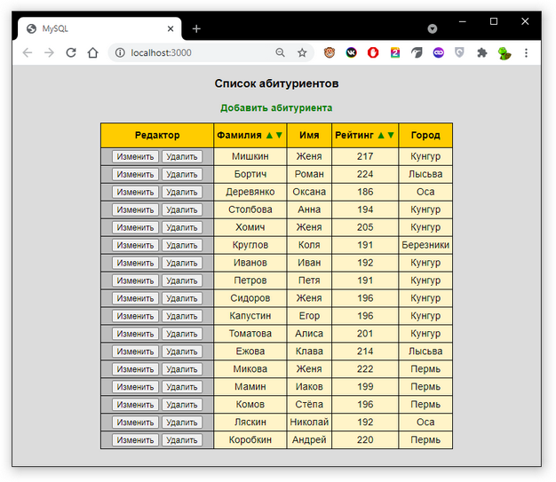  

Интерактивные элементы на странице позволяют сортировать вверх/вниз по Фамилии или Рейтингу, Добавлять, Изменять или Удалять данные про абитуриента через вызов соотвествующих форм:  

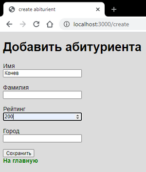  

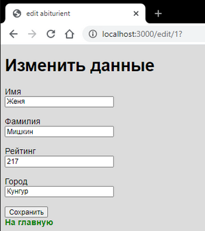  

Рассмотрим работу приложения на примере одного метода get, организующего сортировку. Обратите внимание, что в адрес перехода добавлены параметры по определённому шаблону - "/sort/:field.:direct". Параметров может быть несколько, они разделены точкой, имя параметра пишется после двоеточия. Эти параметры можно будет извлечь в функции обартного вызова через request:  

```js
    const field = req.params.field;
    const direct = req.params.direct;
```

Полученные от пользователя параметры используются для формирования SQL-запроса:  

```SQL
let query = "SELECT * FROM abiturs ORDER BY " + field + " " + direct;
```

После выполнения этого запроса полученные записи отображаются на странице приложения:  

```js
    res.render("index.hbs", {abiturs: data});
```

Давайте ещё уточним как именно параметры со страницы приложения попадают в app.js в исследуемый метод get. Для этого в заголовке таблицы найдите это место:  

```html
    <a href="/sort/lastName.ASC">▲</a>
```

Мы видим, что адрес перехода содержит параметры, разделённые точкой.  

Следует отметить, что, в ряде случаев, для реализации функционала (Создать абитуриента, Редактировать данные) используются два последовательно исполняющихся метода get и post. Метод get организует показ определённой формы, там пользователь вводит данные и нажимает клавишу Submit, после чего запускается метод post. Так как при выполнении метода post данные отправляются с помощью формы, то возникает необходимость в использовании специального парсера - express.urlencoded({extended: false}). В эту функцию передается объект, устанавливающий параметры парсинга. Значение extended: false указывает, что объект - результат парсинга будет представлять набор пар ключ-значение, а каждое значение может быть представлено в виде строки или массива.

---  

Существует множество разных фреймворков и шаблонов проектирования. В данной теме мы ограничились только созданием web-приложения по работе с одной таблицей из базы данных MySQL средствами Express.  

```txt

```
